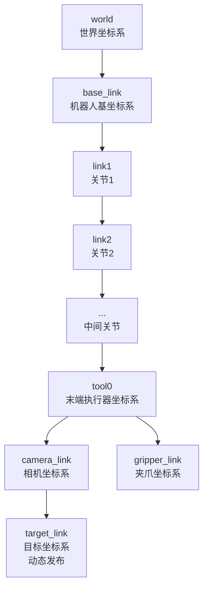
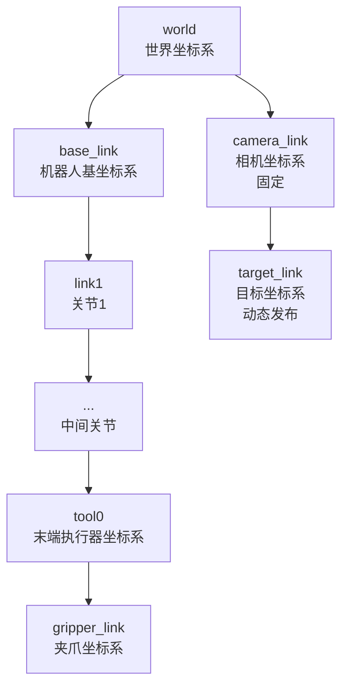

# logistics_robot
基于turtlebot3的物流机器人

# 初步需求
物流场景机器人，二次开发TurtleBot3项目

主要任务：前往地图中指定地方，视觉识别物体，机械手自动抓取，返回指定地方。

技术栈：Socket，WebSocket，Qt，DDS，ZMQ，C++14，Python，Gtest，Realsense，PCL，SLAM，Nav2，Movelt2，BehaviorTree.CPP，docker

1.仓储场景仿真环境，机械臂机器人 
2.运动控制模块 
3.路径规划模块 
4.任务调度模块 
5.视觉作业模块 
6.机械臂模块 
7.本地可视化与远程监控

# 整体架构
~~~
logistics_robot_ws/
├── src/
│   ├── robot_base/                   # 基础支撑层（全系统通用能力）
│   ├── robot_interfaces/             # 全系统标准化接口定义（消息/服务/动作）
│   ├── robot_hardware_hal/           # 硬件抽象层HAL（隔离硬件与上层）
│   ├── robot_execution/              # 执行层（硬件指令执行与反馈采集）
│   ├── robot_perception/             # 感知层（环境感知与状态感知）
│   ├── robot_control/                # 控制层（运动与执行器闭环控制）
│   ├── robot_decision/               # 决策层（任务调度与行为决策）
│   ├── robot_hmi/                    # 人机交互层（外部系统对接与可视化）
│   └── robot_bringup/                # 启动配置层（launch/参数/URDF模型）
├── docs/                             # 接口文档、调试手册、故障码说明
├── scripts/                          # 校准脚本、升级脚本、环境配置脚本
├── tests/                            # 单元测试、集成测试、仿真测试用例
└── README.md
~~~

# 节点职责拆分

表 1：节点职责与技术栈

| 序号 | 节点名称 | 核心职责 | 技术栈 |
| :--: | :-- | :-- | :-- |
| 1 | camera_driver_node | 相机驱动、图像采集、相机参数发布 | C++ |
| 2 | image_preprocessing_node | 图像去噪、畸变校正、ROI 裁剪、深度对齐 | C++ (OpenCV) |
| 3 | detection_pose_estimation_node | 目标检测、实例分割、6D 位姿解算 | C++ (OpenCV + YOLO/TensorRT) |
| 4 | handeye_transform_node | 手眼坐标转换、目标位姿从相机系到机器人基系 | C++ (tf2) |
| 5 | grasp_planning_node | 抓取姿态生成、碰撞预检查、多抓取点排序 | C++ (MoveIt Task Constructor) |
| 6 | motion_planning_node | 运动轨迹规划、碰撞检测、轨迹平滑、速度规划 | C++ (MoveIt2 + OMPL) |
| 7 | robot_control_node | 机器人运动控制、轨迹跟踪、状态反馈 | C++ (ros2_control) |
| 8 | end_effector_node | 末端执行器驱动、夹爪开合控制、力/位置反馈 | C++ (自定义/robotiq 驱动) |
| 9 | grasp_verification_node | 抓取成功校验、物体在位检测、力传感器验证 | C++ (OpenCV + PCL) |
| 10 | global_state_machine_node | 全局任务调度、状态机管理、异常处理、流程控制 | C++ (BehaviorTree.CPP/SMACH) |

表 2：节点输入与输出

| 序号 | 节点名称 | 输入 | 输出 |
| :--: | :-- | :-- | :-- |
| 1 | camera_driver_node | 硬件触发信号 | /camera/image_raw /camera/camera_info /camera/depth/image_raw (深度相机) |
| 2 | image_preprocessing_node | /camera/image_raw /camera/camera_info | /camera/image_processed /camera/depth/aligned |
| 3 | detection_pose_estimation_node | /camera/image_processed /camera/depth/aligned | /detection/target_bbox /detection/target_pose_cam /detection/target_mask |
| 4 | handeye_transform_node | /detection/target_pose_cam /tf_static (手眼标定结果) | /grasp/target_pose_base |
| 5 | grasp_planning_node | /grasp/target_pose_base /robot/state | /grasp/selected_pose /grasp/approach_vector |
| 6 | motion_planning_node | /grasp/selected_pose /robot/state /scene/collision_objects | /motion/trajectory /motion/plan_status |
| 7 | robot_control_node | /motion/trajectory /robot/joint_states | /robot/joint_command /robot/state |
| 8 | end_effector_node | /gripper/command /gripper/force_sensor | /gripper/state /gripper/position |
| 9 | grasp_verification_node | /camera/depth/aligned /gripper/force_sensor /gripper/state | /grasp/verification_result |
| 10 | global_state_machine_node | 所有节点的状态话题 | /task/state /task/command 所有节点的触发服务 |

# 全链路数据流设计

1.视觉流：相机→预处理→检测→手眼转换→目标位姿（机器人基坐标系） 
2.运动流：目标位姿→抓取规划→运动规划→轨迹跟踪→机器人执行  
3.控制流：全局状态机统一调度，根据各节点状态触发下一步操作  
4.反馈流：抓取校验结果→状态机→决定重试 / 结束 / 异常处理  
5.TF 流：所有坐标系通过 TF2 树统一管理，保证位姿转换精度

# TF树设计

方案 A：眼在手上（Eye-in-Hand，推荐，适合移动抓取）

方案 B：眼在手外（Eye-to-Hand，适合固定工位）

TF 树关键说明
静态 TF：手眼标定结果（camera_link→tool0或camera_link→world）通过tf_static发布，永久不变  
动态 TF：机器人关节 TF 由robot_state_publisher发布，目标坐标系target_link由detection_pose_estimation_node动态发布  
坐标系约定：严格遵循 REP 103（米、弧度、右手系），REP 105（移动机器人坐标系）  
TF 发布频率：机器人关节 TF≥100Hz，目标坐标系 TF≥30Hz
