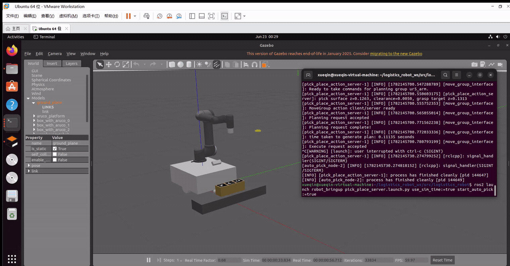

# logistics_robot

logistics_robot 是一个基于 ROS 2 Humble 的仓储移动操作机器人仿真项目。项目模拟一台 AGV 搭载 UR5 机械臂，在 Gazebo 中识别带有 ArUco 标记的目标箱体，并完成抓取与放置流程。

当前版本：**v0.1-mvp**

该版本主要用于验证端到端仿真链路：目标检测、任务调度、机械臂运动规划、Gazebo 中的物体 attach / detach，以及系统级启动流程。真实机器人硬件接入、完整夹具建模、GUI 和更复杂的任务调度将在后续版本中扩展。

## Demo


演示自动检测 ArUco 方块后进行抓取和放置，整个流程重复 3 次。

## 功能特性

- 仓储 AGV 仿真模型
- UR5 机械臂集成
- 基于 ArUco 的目标检测
- 基于 MoveIt 2 的机械臂运动规划
- 使用 `IFRA_LinkAttacher` 在 Gazebo 中模拟物体抓取与释放
- 基于 FSM 的任务调度节点
- 自定义 ROS 2 消息、服务和 action
- ROS 2 Humble CI 构建与测试流程
- Docker 开发与验证环境

## 系统概览

系统按职责可以分为三层：

```text
应用与任务层
  robot_decision | robot_perception | PickAndPlace Action Client
  负责目标检测、任务触发、抓取目标生成和自动抓取流程调度。

规划与执行层
  robot_control | MoveIt 2 | ros2_control
  负责 PickAndPlace Action Server、机械臂路径规划、轨迹执行和控制器管理。

模型、仿真与硬件抽象层
  robot_description | robot_simulation | robot_hardware_hal | Gazebo Classic | IFRA_LinkAttacher
  负责机器人模型、仿真世界、传感器/夹爪 HAL，以及仿真中的物体吸附与释放。
```

v0.1 版本聚焦于仿真验证，不包含真实机器人部署。

## 仓库结构

```text
logistics_robot/
  robot_bringup/          系统启动与 launch 配置
  robot_control/          抓取放置控制与 MoveIt 2 集成
  robot_decision/         基于 FSM 的任务调度逻辑
  robot_description/      机器人 URDF/Xacro 模型
  robot_hardware_hal/     硬件抽象层与仿真 HAL
  robot_interfaces/       自定义 ROS 2 msg/srv/action
  robot_perception/       ArUco 检测与感知流程
  robot_simulation/       Gazebo world 与仿真资源
  docker/                 Docker 开发环境
  docs/                   文档与 demo 资源
```

## 运行环境

- Ubuntu 22.04
- ROS 2 Humble
- Gazebo Classic 11
- MoveIt 2
- OpenCV
- Colcon
- Docker，可选
- `IFRA_LinkAttacher`

外部依赖 `IFRA_LinkAttacher` 建议固定到以下 commit：

```bash
git clone -b humble https://github.com/IFRA-Cranfield/IFRA_LinkAttacher.git
cd IFRA_LinkAttacher
git checkout b056289ba93ccb549db98926dcbb9679642d0c8d
```

## 快速开始

创建工作空间：

```bash
mkdir -p ~/logistics_robot_ws/src
cd ~/logistics_robot_ws/src
git clone https://github.com/chenmengangzhi29/logistics_robot.git
git clone -b humble https://github.com/IFRA-Cranfield/IFRA_LinkAttacher.git
cd IFRA_LinkAttacher
git checkout b056289ba93ccb549db98926dcbb9679642d0c8d
```

安装依赖：

```bash
cd ~/logistics_robot_ws
source /opt/ros/humble/setup.bash
rosdep update
rosdep install --from-paths src --ignore-src -r -y
```

构建：

```bash
colcon build --symlink-install
source install/setup.bash
```

启动仿真：

```bash
ros2 launch robot_bringup system_sim.launch.py
```

## Docker 使用

构建镜像：

```bash
docker build -t logistics_robot:humble -f docker/Dockerfile .
```

如果需要使用国内镜像源，可以使用 build args：

```bash
docker build -t logistics_robot:humble -f docker/Dockerfile \
  --build-arg UBUNTU_MIRROR=https://mirrors.tuna.tsinghua.edu.cn/ubuntu \
  --build-arg UBUNTU_SECURITY_MIRROR=https://mirrors.tuna.tsinghua.edu.cn/ubuntu \
  --build-arg ROS_MIRROR=https://mirrors.tuna.tsinghua.edu.cn/ros2/ubuntu \
  --build-arg ROSDEP_BASE_URL=https://mirrors.tuna.tsinghua.edu.cn/github-raw/ros/rosdistro/master \
  --build-arg ROSDISTRO_INDEX_URL=https://mirrors.tuna.tsinghua.edu.cn/rosdistro/index-v4.yaml \
  .
```

运行容器：

```bash
xhost +local:docker

docker run --rm -it \
  --name logistics_robot_dev \
  --net=host \
  -e DISPLAY=$DISPLAY \
  -v /tmp/.X11-unix:/tmp/.X11-unix \
  -v ~/logistics_robot_ws:/root/logistics_robot_ws \
  logistics_robot:humble
```

容器内执行：

```bash
cd /root/logistics_robot_ws
colcon build --symlink-install
source install/setup.bash
ros2 launch robot_bringup system_sim.launch.py
```

## 主要模块


| 包名                   | 说明                            |
| -------------------- | ----------------------------- |
| `robot_description`  | 机器人模型、URDF/Xacro、AGV 与 UR5 描述 |
| `robot_simulation`   | Gazebo world 与仿真配置            |
| `robot_interfaces`   | 自定义消息、服务和 action              |
| `robot_perception`   | ArUco 检测与目标位姿估计               |
| `robot_control`      | 基于 MoveIt 2 的抓取放置执行           |
| `robot_decision`     | 基于 FSM 的任务调度节点                |
| `robot_hardware_hal` | 仿真 HAL 与硬件抽象层                 |
| `robot_bringup`      | 系统启动 launch 文件                |


## 数据流

```text
相机 / 仿真环境
  -> ArUco 检测
  -> 目标位姿
  -> mission driver
  -> pick/place action
  -> MoveIt 2 运动规划
  -> Gazebo attach / detach
  -> 任务状态更新
```

## 任务流程

v0.1 中的任务调度逻辑使用有限状态机实现：

```text
IDLE -> DETECT -> PICK -> PLACE -> DONE
```

后续版本会扩展失败处理、重试策略和更复杂的任务编排逻辑。

## CI

项目包含 GitHub Actions CI，用于在 ROS 2 Humble 环境中执行构建与测试：

```bash
colcon build --event-handlers console_direct+
colcon test --event-handlers console_direct+
colcon test-result --verbose
```

CI 中需要拉取外部依赖 `IFRA_LinkAttacher`，并建议固定到指定 commit，避免上游变更导致构建结果不稳定。

## 已知限制

- v0.1 主要在 Gazebo 仿真环境中验证。
- 当前版本暂未接入真实机器人硬件。
- 抓取效果通过 `IFRA_LinkAttacher` 模拟物体与末端执行器的 attach / detach，不是真实夹具物理模型。
- 不同仿真场景下，检测、抓取和放置参数可能需要重新调节。
- 节拍时间、检测成功率、抓取成功率等性能指标尚未自动统计。

## 路线图

### v0.2

- 完善任务失败处理与重试逻辑
- 优化感知参数配置
- 整理 launch 与参数文件结构
- 增加控制和感知模块测试

### 后续计划

- 使用 BehaviorTree.CPP 替换或增强 FSM 任务逻辑
- 增加 Qt/QML 或 Web 操作界面
- 增加真实夹具 / 末端执行器抽象
- 完善手眼标定流程
- 接入真实机器人硬件
- 增加自动化性能评估

## License

Apache-2.0